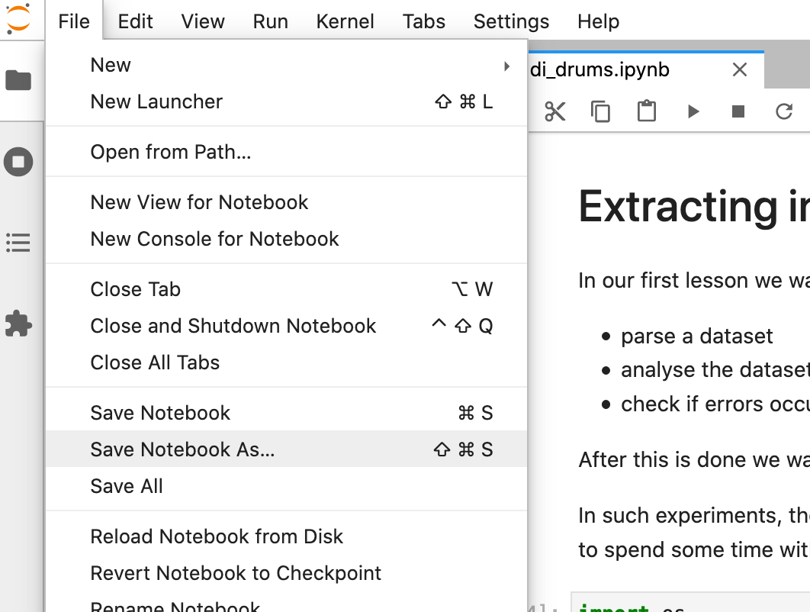

Environment setup
=================

This document will lead you through the setup so one can run the code on a local machine.

Binder
------

`Binder <https://mybinder.org/>`__ is a service in which lets you use 
computational resources from big tech companies free of charge and
without any registering or setup.
Click `here <https://mybinder.org/v2/gh/capital-G/musikinformatik-sose2021/main?urlpath=lab>`__ to
use a *Binder* instance where everything is set up for you.

Please have in mind that these machines are free of charge and
therefore the resources are quite limited and some computations
will not work because we will rely on some heavy computation.

.. todo::

  Currently SuperCollider is not working in this environment as
  this requires a headless version of SuperCollider in Docker
  which is not trivial at this point.

  If somebody knows how to set this up please open a Pull Request.

Repository setup
----------------

To copy the course material to the local machine we will use `git <https://git-scm.com/>`_.
For the install procedure please refer to the `official website <https://git-scm.com/downloads>`_.

After one has setup git we now need to `clone <https://www.atlassian.com/git/tutorials/setting-up-a-repository/git-clone>`_
the `repository <https://github.com/capital-G/musikinformatik-sose2021>`_ by opening a new shell window and head to a
directory in which you want to copy the course material and execute the command

.. code-block:: shell

  git clone https://github.com/capital-G/musikinformatik-sose2021.git

If you know what *SSH*, have a GitHub account and you want to participate in the creation of the course
one should use SSH instead so the command becomes

.. code-block:: shell

  git clone git@github.com:capital-G/musikinformatik-sose2021.git

Now as we have cloned the course material to a local directory we want to switch to the directory which we just
created by cloning the repository

.. code-block:: shell

  cd musikinformatik_sose2021

.. admonition:: Convention

   We will refer to this folder as *the root folder of the repository*.
   Most commands will be executed in this folder and we will always work relative
   to this path.
   
   Please make sure if you e.g. re-start *Jupyter Lab* or you activate the 
   virtual environment you are in this directory before entering the commands.

SuperCollider setup
-------------------

Please refer to the `SuperCollider download page <https://supercollider.github.io/download>`_
for the install instructions of SuperCollider.

When working with macOS we assume that you have installed SuperCollider in ``/Applications/SuperCollider`` so
the following command should yield the version number of SuperCollider

.. code-block:: shell

  /Applications/SuperCollider.app/Contents/MacOS/sclang -v

If you have installed SuperCollider in a different location you can set the environment variable ``SCLANG_PATH`` to the
path where your *sclang* executable is located.

Python setup
------------

Installing Python
^^^^^^^^^^^^^^^^^

Please make sure you have installed *Python 3.8*, *pip3* and *virtualenv* on your machine.
A good guide on how to install *Python* on your machine can be found `here <https://realpython.com/installing-python/>`__.

.. warning::

  Please refrain from *Python 3.9* as this is `not supported by Tensorflow yet <https://github.com/tensorflow/tensorflow/issues/44485>`_.
  The default homebrew setup will install the latest Python version which is 3.9 which will not work for our experiments.
  If you use `Homebrew <https://brew.sh/>`_ on macOS you can install version 3.8 by executing 

  .. code-block:: shell
    
    brew install python@3.8

.. _virtualenv-install:

Installing *virtualenv*
^^^^^^^^^^^^^^^^^^^^^^^

Python is a language that relies on libraries - e.g. the parsing of MIDI files is not
build-in to the language but `there is a collection of MIDI libraries <https://pypi.org/search/?q=midi>`__
that allows Python to work with MIDI files.
It turns out that it is a good practice to not mix too many libraries as they are maybe not compatible
to each other - maybe library *A* relies on version 0.2 of library *B* but library *C* relies on
version 1.2 of library *B* - welcome to `dependency hell <https://en.wikipedia.org/wiki/Dependency_hell>`__.

The solution to this is to create an isolated environment for each project - so the clashing of incompatible
versions does not occur.
It is also possible to determine which version of Python we want to use for our project which
is relevant to us.

*virtualenv* provides us with such a functionality and we can install it by running

.. code-block:: shell

  pip3 install virtualenv

in a terminal.

We use ``pip3`` for installation of *virtualenv* which is a
`package manager <https://en.wikipedia.org/wiki/Package_manager>`__ for python libraries.

After a successful installation please check that you have the following 

.. code-block:: shell

  python3 --version
  # Python 3.8.x
  # macOS users who installed python 3.8 via homebrew should check
  # /usr/local/opt/python@3.8/bin/python3 --version

  pip3 --version
  # pip 21.0.1 from /usr/local/lib/python3.8/site-packages/pip
  # just about any pip3 version will be fine

  virtualenv --version
  # virtualenv 20.4.2 from /usr/local/lib/python3.8/site-packages/virtualenv/__init__.py
  # just about any virtualenv version will be fine - make sure that it refers to your
  # python3 folder from above and not to e.g. python2

.. _virtualenv-create:

Creating a new virtual environment
^^^^^^^^^^^^^^^^^^^^^^^^^^^^^^^^^^

After we have installed virtualenv (see :ref:`virtualenv-install`) we now use it to create a new
virtual environment for our project.

Go to the root folder of the repository (see :ref:`Repository setup`) with a shell and execute
the command in this folder to create a new virtual environment in the folder ``venv``
  
.. code-block:: shell

  virtualenv venv

.. warning::

  macOS users who installed python 3.8 with homebrew should instead call
  
  .. code-block:: shell
    
    virtualenv --python=/usr/local/opt/python@3.8/bin/python3 venv

.. _virtualenv-activate:

Activating the virtual environment
^^^^^^^^^^^^^^^^^^^^^^^^^^^^^^^^^^

After we have installed the virtual environment it is now time to activate it
so we install the necessary libraries (such as e.g. *Jupyter Lab*) to the
isolated environment and not to the *global* Python installation on your machine.

Assuming you are in the root folder of the repository (see :ref:`Repository setup`)
and created a virtual environment (see :ref:`virtualenv-install`) it is as simple
as executing the command

.. code-block:: shell

  # on linux/macOS
  source venv/bin/activate
  # on windows
  source ./venv/Scripts/activate

After the virtual environment has been successfully activated something ``(venv)`` will
be shown in the command prompt.

.. _install-dependencies:

Installing dependencies
^^^^^^^^^^^^^^^^^^^^^^^

After we have activated the virtual environment (see :ref:`virtualenv-activate`)
we can now install all necessary libraries for our project by running.

.. code-block:: shell
  
  pip3 install -r requirements.txt

.. _start-jupyter:

Start *Jupyter Lab*
^^^^^^^^^^^^^^^^^^^

After we have installed all necessary libraries (see :ref:`Installing dependencies`)
it is now time to start *Jupyter Lab* which is a coding environment for our browser
in which we can code Python and SuperCollider.

Please make sure you have activated the virtual environment (see :ref:`virtualenv-activate`)
and execute the command

.. code-block:: shell

  jupyter lab

To shut down the *Jupyter Lab* server enter the keyboard combination of ``<Ctrl> + c``
in the shell window in which the Jupyter server is running.
A prompt will appear in which one has to verify that one wants to shut down the
server by entering ``y``.

Documentation
^^^^^^^^^^^^^

.. admonition:: Note

  This is only an optional step if you want to participate in improving the course material.

In order to build the documentation locally one also needs to install its dependencies by executing the
following command in the root directory of the repository (see :ref:`Repository setup`)

.. code-block:: shell

  pip3 install -r requirements-docs.txt

After this the documentation can be build by executing the shell script

.. code-block:: shell

  ./build_docs.sh

from the root directory of this repository.

.. admonition:: Convention

  If you want to open the documentation in a browser after it has been build you can set the
  environment variable

  .. code-block:: shell

    export OPEN_BROWSER_AFTER_TEST=true
  
  when using the ``./build_docs.sh`` script.

  Remember that this has to be set every time you open a shell or you add it to your ``~/.zshrc`` or else.

Setup via Docker
----------------

Alternatively, if one has `Docker <https://www.docker.com>`_ installed, one can also run the notebooks in a docker container by executing

.. code-block:: shell

    docker build -t musikinformatik . && docker run -p 8888:8888 -v ${PWD}:/home/musikinformatik musikinformatik

while being in the root directory of the repository and click on the appearing link.

.. todo::

  Currently it is difficult to run SuperCollider in an headless environment such as Docker,
  therefore SuperCollider is omitted in the docker image.

  Any help on this is appreciated.

Updating and working with the repository
----------------------------------------

The course material is stored and distributed via `git <https://git-scm.com/>`__.
As there are constantly updates on the course material there will be conflicts
when we have worked locally on a notebook.
This is because *git* does not know how to resolve
the local changes with the remote updates - this is commonly known as
`merge conflicts <https://www.atlassian.com/git/tutorials/using-branches/merge-conflicts>`__.

Probably the best way is to save the notebook on which you work locally to a new
notebook - this can be done by clicking on the *Save Notebook As ...* button
under the *File* menu in the upper left corner of Jupyter Lab.

  Save a notebook under a new name to avoid any problems when updating the course
  material.

Updating the course material
^^^^^^^^^^^^^^^^^^^^^^^^^^^^

Assuming that you have saved all the changes you want to keep in a new notebook
and you are in the root repository of repository,
the following commands will update the course material

.. code-block:: shell

  # remove any changes from existing files
  git reset --hard
  # get newest changes
  git pull

It may be necessary that new dependencies got introduced during the update,
so its always a good idea to quickly install any new dependencies - see
:ref:`Installing dependencies` on how to do this.
